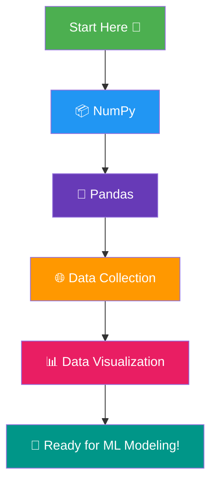

# Machine Learning Tutorial 🚀

A step-by-step, hands-on Machine Learning tutorial repository built from real Colab notebooks.
This repo is **continuously updated** — new notebooks and sections will keep getting added as the learning progresses. Think of it as a living, running tutorial rather than a one-time upload.

Whether you're an absolute beginner or brushing up your fundamentals, follow the sections below **in order** for the smoothest learning experience.

---

## 🗺️ Learning Path



**Recommended order:** `NumPy → Pandas → Data Collection → Data Visualization → (upcoming: ML Algorithms)`

> 📌 This diagram will grow as new topic folders (e.g., Data Preprocessing, ML Algorithms, Deep Learning) are added to the repo.

---

## 📦 Section 1: NumPy

Foundation of numerical computing in Python — arrays, vectorized operations, and math that powers every ML library.

| Notebook | Description |
|---|---|
| `01_numpy.ipynb` | Introduction to NumPy — array creation, basic operations, and core fundamentals. |
| `02_numpy.ipynb` | Deeper dive into NumPy — indexing, slicing, reshaping, and advanced array operations. |
| `100_Numpy_exercises.ipynb` | 100 practice exercises to master NumPy through hands-on problem solving. |

---

## 🐼 Section 2: Pandas

The go-to library for handling, cleaning, and analyzing structured/tabular data — the backbone of every real-world ML project.

| Notebook | Description |
|---|---|
| `02_series_PD.ipynb` | Understanding Pandas Series — the building block of DataFrames. |
| `02_data_load.ipynb` | Loading datasets into Pandas from various file formats. |
| `04_work_with_large_dataset.ipynb` | Techniques to efficiently handle and process large datasets. |
| `05_cleaning_data.ipynb` | Data cleaning basics — handling missing values, duplicates, and inconsistent data. |
| `06_feature_engineering.ipynb` | Creating and transforming features to improve model-readiness of data. |
| `07_Aggregation_methods.ipynb` | GroupBy and aggregation techniques for summarizing data. |
| `08_melt_&_pivot.ipynb` | Reshaping data using melt and pivot operations. |
| `09_visualation_with_pandas.ipynb` | Quick data visualization directly using Pandas' built-in plotting. |
| `10_merge_&_join_data.ipynb` | Combining multiple datasets using merge and join operations. |
| `11_concatination_dataFrames.ipynb` | Concatenating DataFrames vertically and horizontally. |

---

## 🌐 Section 3: Data Collection

How to actually get real-world data — through APIs and web scraping — before any analysis can begin.

| Notebook | Description |
|---|---|
| `01_api_data.ipynb` | Collecting data from public APIs and converting responses into usable datasets. |
| `02_web_scraping.ipynb` | Scraping data from websites using web scraping techniques. |

---

## 📊 Section 4: Data Visualization

Turning raw numbers into visual insights using Matplotlib and Seaborn — essential for exploratory data analysis (EDA).

| Notebook | Description |
|---|---|
| `01_matplotlib_tutorial(line_chart).ipynb` | Getting started with Matplotlib — building line charts. |
| `02_Bar_charts.ipynb` | Creating bar charts to compare categorical data. |
| `03_scatter_chart.ipynb` | Scatter plots for visualizing relationships between variables. |
| `04_pie_chart.ipynb` | Pie charts for showing proportions and distributions. |
| `05_histograms.ipynb` | Histograms for understanding data distribution. |
| `06_box_plot.ipynb` | Box plots for spotting outliers and data spread. |
| `07_stack_plot_&_subplot.ipynb` | Stacked plots and subplots for multi-part visualizations. |
| `08_modern_matplotlib.ipynb` | Modern/advanced Matplotlib styling and techniques. |
| `09_seaborn_tutorial.ipynb` | Statistical data visualization using Seaborn. |

---

## 🔜 Coming Up Next

This repo is actively growing. Planned upcoming sections:

- 🧹 Data Preprocessing & Feature Scaling
- 🤖 Supervised Learning Algorithms (Regression, Classification)
- 🧩 Unsupervised Learning (Clustering, Dimensionality Reduction)
- 🧠 Model Evaluation & Hyperparameter Tuning
- 🔮 Deep Learning Basics

---

## ▶️ How to Use This Repo

1. Clone the repository:
   ```bash
   git clone https://github.com/<your-username>/machine-learning-tutorial.git
   ```
2. Open any notebook in **Jupyter Notebook**, **VS Code**, or directly in **Google Colab**.
3. Follow the sections top-to-bottom as shown in the Learning Path diagram.
4. Practice alongside each notebook — run the cells, tweak the code, and experiment.

---

## ⭐ Support

If this repo helps you learn, consider giving it a ⭐ — and check back often since new topics are added regularly.